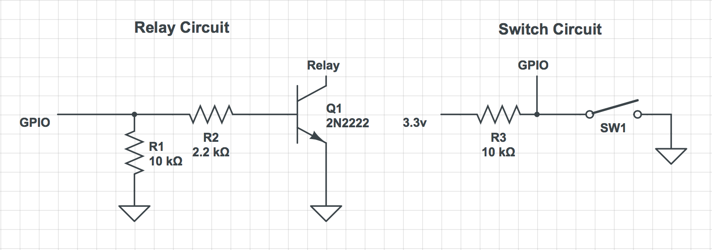

# PirageKit

Simple [HomeKit](https://www.apple.com/ios/home/) enabled [Go](https://golang.org)
program targeted for the [Raspberry Pi](https://www.raspberrypi.org) platform to
control garage doors connected via GPIO.

## Why?

Seemed ridiculous to replace my existing garage door openers or to buy an expensive
add-on just so I can have Siri open my garage door. Since I already had a Pi
laying around, I figured adding a few reed switches and relays would not hurt.

## Requirements

1. Raspberry Pi with at least 3 GPIO pins available per door you want to control
2. 2 reed switches (NO)
3. Some form of a relay (I use a [Sain Smart relay](https://www.sainsmart.com/products/8-channel-5v-relay-module))

## Building

    $ VERSION=sem.version.number make

## Setup

Use the wiring diagram below to assist you in wiring up the Pi to your relay and
switches. If you are not using a Sain Smart relay, you will most likely not need
the circuit documented below or will need a different circuit.

You will need to position the two reed switches in a way that the "bottom" is
in a closed state when the door is in the closed position and the "top" switch
is in a closed state when the door is in the open position.

Once everything is wired up, configure piragekit and run it. Launch Home on iOS
and tap +, tap Add Accessory, tap "Don't Have a Code or Can't
Scan?". You should see PirageKit show up as a square. Tap it and enter the code
you configured earlier. 

### Configuration

#### HomeKit

| Key | Meaning |
|-----|---------|
| pin | PIN used when adding devices to Home. Global across all doors |
| storage_path | Location on disk where the HomeControl database is stored. Defaults to `/var/tmp/piragekit` |

#### Doors

| Key | Meaning |
|-----|---------|
| name | Name used to reference the garage door. Will show up as this name in Home |
| manufacturer | Name of garage door opener manufacturer |
| model | Model of garage door opener |
| top_gpio | BCM GPIO pin used for the top reed switch. This is used to determine if the door is open. |
| bottom_gpio | BCM GPIO pin used for the bottom reed switch. This is used to determine if the door is closed. |
| relay_gpio | BCM GPIO pin used for the relay. This is used to open/close the door. |

### Wiring Diagram

